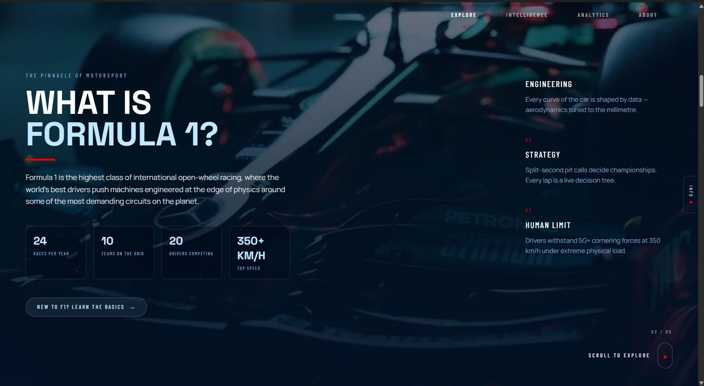
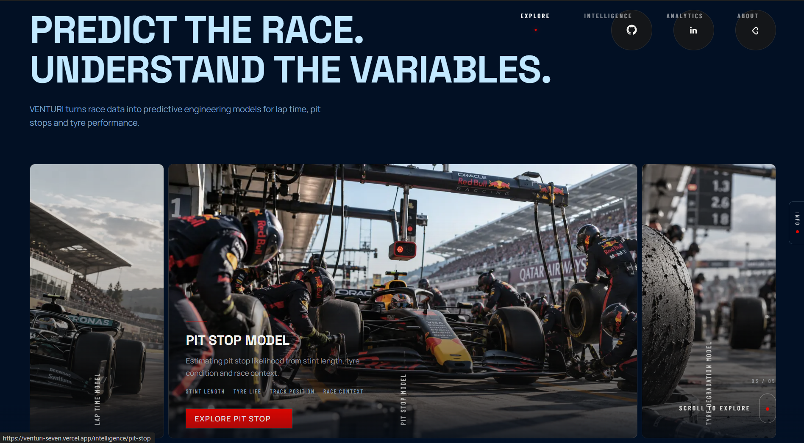
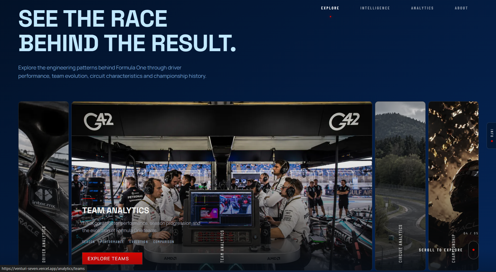
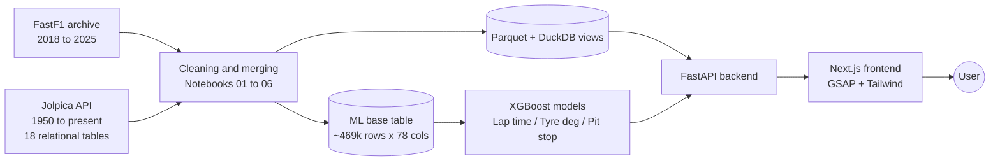

<div align="center">

# VENTURI

### An F1 engineered intelligence.

**72 GB of raw Formula 1 data, turned into three working ML models and a cinematic full-stack web app.**

[**Live Demo**](https://venturi-seven.vercel.app) · [**API Docs**](https://venturi-backend-9y79.onrender.com/docs) · [**Walkthrough Video**](https://www.youtube.com/watch?v=1xS7sntQlaY) · [**Author**](https://www.linkedin.com/in/abdur-rahman-ab506829a/)


</div>

---


---

## What is VENTURI?

VENTURI is a complete data science project, built end to end. It starts with a raw multi-year F1 data archive and ends with a hosted web app where anyone can explore historical analytics and run live predictions for **lap time**, **tyre degradation** and **pit stop likelihood**.

Most portfolio projects stop at a notebook. This one does not. It covers the full lifecycle:

**Data collection** → **Cleaning and relational modelling** → **Deep EDA** → **Feature engineering** → **Model training and validation** → **API** → **Interactive frontend** → **Deployment**

Every stage was built step by step and verified by hand. No black-box pipeline, no copy-paste code that I could not explain in an interview.

---

## The numbers

| | |
|---|---|
| Raw data archive | **72+ GB** (FastF1 telemetry, 2018 to 2025, plus Jolpica history, 1950 to present) |
| ML base table | **~469,000 rows x 78 columns**, one row per driver per lap |
| Relational history | **18 tables**, ~868K rows, fully loaded and explored |
| Models shipped | **3** (2 regression, 1 classification) |
| Notebooks | **6** pipeline notebooks, from download to ML-ready table |
| Data download time | ~24 to 30 hours of rate-limited API requests |

---

## Demo

| Explore | Intelligence | Analytics |
|---|---|---|
|  |  |  |

### Full walkthrough

[](https://www.youtube.com/watch?v=1xS7sntQlaY)

**Try it yourself:** [https://venturi-seven.vercel.app](https://venturi-seven.vercel.app)

Note: the backend is on a free tier, so the first request after a period of inactivity can take a few seconds to wake up.

---

## The three models

All three models are XGBoost, trained on the same lap-level base table, and loaded at API startup. The user only needs to give a few inputs. The API derives the rest of the features automatically and fills any optional field from **historical averages for that circuit**.

### 1. Lap Time Prediction (regression)

| Metric | Score |
|---|---|
| MAE | **1.72 s** |
| R² | **0.896** |

Predicts a lap time given driver, circuit, compound, tyre age, stint position and race conditions.

### 2. Tyre Degradation (regression)

| Metric | Score |
|---|---|
| MAE (dry compounds) | **0.968 s** |
| R² | **0.253** |

Predicts how much time a tyre loses relative to its stint baseline as it ages.

**An honest note on this one:** the R² is low, and I am not hiding it. Degradation is a small, noisy signal buried under fuel load, traffic, track evolution and driver behaviour. An error under one second on a delta that small is useful, but the model explains only a part of the variance. I would rather show a real number than a flattering one.

### 3. Pit Stop Prediction (classification)

| Metric | Score |
|---|---|
| PR-AUC | **0.700** (on a held-out 2025 season) |

Predicts whether a driver will pit on a given lap. Pit laps are rare, so PR-AUC is the right metric here, not accuracy. Validation is done on a **full unseen season**, not a random split, so it reflects how the model would behave on future races.

---

## Engineering lessons (the part I am most proud of)

Building the models was the easy part. Making sure the numbers were **true** took most of the effort. A few things I caught along the way:

**A leakage bug that nearly fooled me.**
A data quality flag in the telemetry turned out to be 100% correlated with pit laps. With it, the pit stop model showed a beautiful PR-AUC of **0.929**. Without it, the honest score was around **0.67**. I found it by auditing every binary feature against the target, and removed it. Always ask why a score is that good.

**"Clean lap" is harder than it sounds.**
A green flag status alone does not give you a clean lap. Isolating true racing pace required also excluding safety car, virtual safety car and yellow flag laps. Stint baselines needed the best of the first few clean laps, because the very first lap of a stint is an out-lap.

**Real-world data is weird.**
- A red flag at the start of the 2024 Monaco GP baked ~2400 second "lap times" into the timestamps. Flagged and excluded from lap time modelling.
- Safety car starts (like the 2025 Belgian GP) make lap 1 systematically unpredictable. Documented as a known limitation, not hidden.
- 2018 used absolute tyre compound names, 2019 onwards uses relative per-weekend names. Needed an event-level mapping to keep seasons consistent.
- A throttle value of 104 is a sensor error code on stationary cars, not real data.

**Merge discipline saved the project.**
Row counts and grain were checked before and after every single merge. That habit caught a silent variable overwrite that had dropped hundreds of thousands of rows. Null-key merges can also fan out and balloon a table without any error, so every join was verified.

**Never trust a saved feature list.**
A saved feature file went stale and silently disagreed with the trained model. The API now reads feature names directly from the model booster, so training and serving can never drift apart.

---

## Architecture



**Why DuckDB?** It queries Parquet files directly with SQL, needs no server, and is very fast for analytical reads. The FastF1 data and all 18 Jolpica tables are exposed as views, so the API is essentially a thin layer over clean SQL.

---

## Tech stack

| Layer | Tools |
|---|---|
| Data sources | FastF1, Jolpica API |
| Data and analysis | Python, pandas, NumPy, Parquet, DuckDB, Plotly, Jupyter |
| Machine learning | XGBoost, scikit-learn (RandomizedSearchCV, GroupKFold) |
| Backend | FastAPI, uvicorn |
| Frontend | Next.js 16 (App Router, Turbopack), Tailwind CSS v4, GSAP + ScrollTrigger |
| Typography | Space Grotesk, Barlow Condensed, Manrope |
| Hosting | Render (backend), Vercel (frontend) |

---

## The website

A single cinematic scroll experience with five sections:

1. **Hero** - the entry point
2. **Explore** - drivers, teams, circuits and standings, backed by 70+ years of data
3. **Intelligence** - run the three ML models with your own inputs
4. **Analytics** - historical charts and insights
5. **About** - the story behind the project

Built with heavy GSAP + ScrollTrigger animation, custom design tokens, and a deliberately dramatic, premium look. F1 is a spectacle, so the site should feel like one.

---

## API overview

The backend is a FastAPI app with auto-generated interactive docs at [`/docs`](https://venturi-backend-9y79.onrender.com/docs).

| Area | What it does |
|---|---|
| Drivers | Career stats, results and history |
| Teams | Constructor performance over time |
| Circuits | Circuit-level records and averages |
| Standings | Driver and constructor championship analytics |
| Predict: lap time | Returns a predicted lap time |
| Predict: tyre degradation | Returns predicted degradation |
| Predict: pit stop | Returns pit probability for a lap |

> Tip: send optional numeric fields as `null`, not `0`, to trigger circuit-average auto-fill.

---

## Project structure

```
F1-AI/
├── notebooks/        # 01_download -> 06_ml_base, the full data journey
├── data/
│   ├── raw/          # untouched source data
│   ├── interim/      # intermediate cleaning stages
│   └── processed/    # parquet files, ML base table
├── models/           # trained XGBoost models
├── backend/          # FastAPI + DuckDB service
├── frontend/         # Next.js app
├── src/              # reusable code
├── sql/              # analytical queries
├── docs/             # documentation and assets
└── tests/
```

---

## Run it locally

```bash
# 1. Clone
git clone [https://github.com/rahven-man/Venturi]
cd F1-AI

# 2. Backend
cd backend
python -m venv venv
venv\Scripts\activate          # Windows
pip install -r requirements.txt
uvicorn main:app --reload      # runs on http://localhost:8000

# 3. Frontend (new terminal)
cd frontend
npm install
npm run dev                    # runs on http://localhost:3000
```

The full raw archive is 72+ GB and is **not** included in this repo. The deployed version runs on a processed subset. See the notebooks for how the full dataset is rebuilt from source.

---

## Known limitations

Being upfront about these is part of the project:

- Tyre degradation has modest explanatory power (R² 0.253). It is a hard, noisy target.
- Safety car starts cause systematic lap 1 underprediction.
- Models are trained on the 2018 to 2025 era of F1 and will not generalise to major regulation changes without retraining.
- The free-tier backend has cold starts.

---

## What I learned

- How to treat data quality and leakage as the main job, not a side task
- How to design a relational data model and query it fast with DuckDB
- How to validate time-series-like data properly, with season-level holdouts and grouped CV
- How to take a trained model out of a notebook and serve it behind an API
- How to build and deploy a full-stack app with serious frontend animation
- How to document limits honestly instead of chasing a pretty metric

---

## About the author

**Abdur Rahman (Rahven)**, B.Tech Computer Science student, building toward a career in data science and analytics. VENTURI is my proof that I can take a problem from raw data to a shipped product.

[LinkedIn](https://www.linkedin.com/in/abdur-rahman-ab506829a/) · [GitHub](https://github.com/rahven-man) 

---

## Acknowledgements

- [FastF1](https://github.com/theOehrly/Fast-F1) for the telemetry and timing data
- [Jolpica F1 API](https://github.com/jolpica/jolpica-f1) for historical race data

VENTURI is an independent fan and learning project. It is not affiliated with Formula 1, the FIA or any team.

---

<div align="center">

**If this project impressed you, drop a star. It genuinely helps.**

</div>